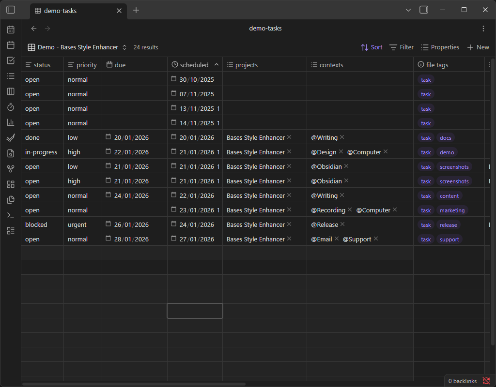
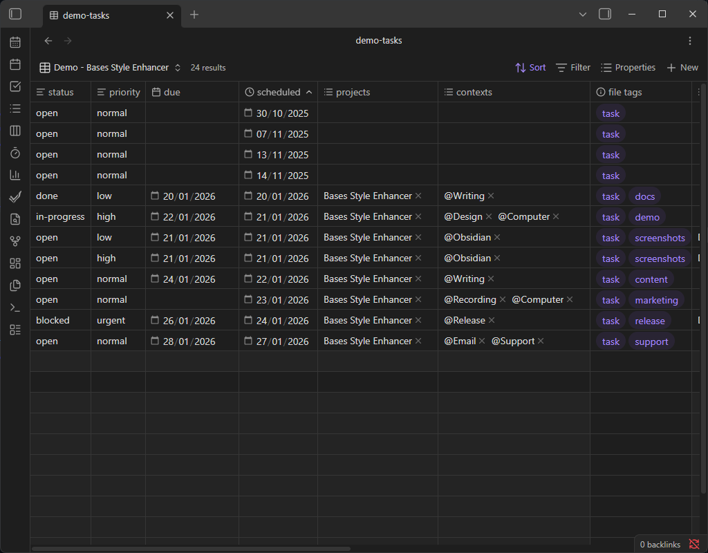
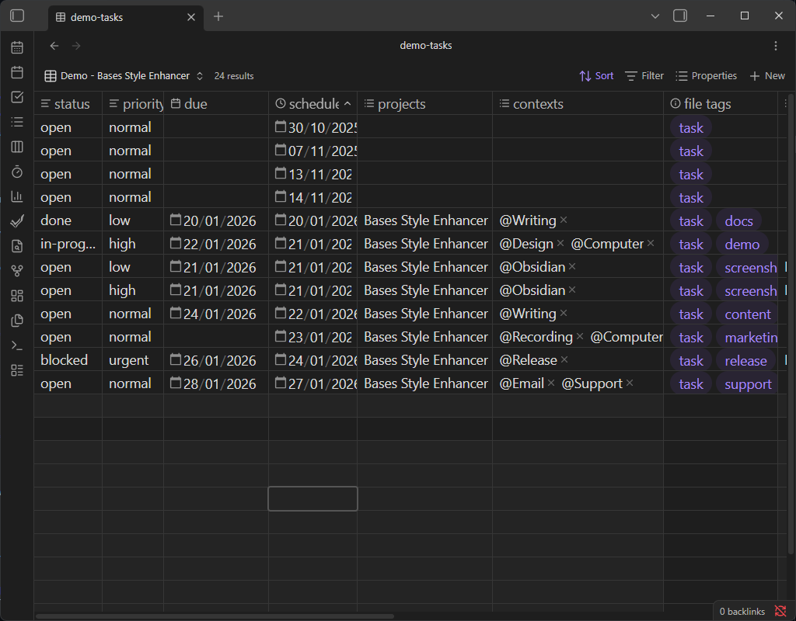

## Bases Style Enhancer

Customize the appearance of Obsidian **Bases** views.

This first version focuses on table font size. It injects a custom CSS variable and rules so that all Bases table cells (and optionally headers) use a configurable font size. Future updates may add more style options for Bases views.

### Features

- Adjust Bases table cell text size globally.
    - Choose units: `rem` or `px`.
    - Optionally apply the same size to table headers.

### How to use

1. Install and enable **Bases Style Enhancer** from the Community plugins tab.
2. Open a Bases table view.
3. Adjust the settings until the table text is comfortable to read.

### Settings

Open **Settings → Community plugins → Bases Style Enhancer → Options**:

- **Table font size value** – numeric value like `1.0` or `16`.
- **Units** – `rem` (relative to base text size) or `px`.
- **Apply to table headers** – when enabled, headers use the same font size as cells.

### Compatibility

- Requires Obsidian **1.5.0** or higher.

### Screenshots

- **Before** – Bases table text uses the default font size.

    

- **After (1.0rem)** – table text will match the base text size of Obsidian.

    

- **After (1.25rem)** – table text is moderately larger for improved readability.

    

- **After (20px)** – table text is significantly larger for maximum readability.

    

### Support

If this plugin improves your Bases experience and you’d like to support development, you can:

